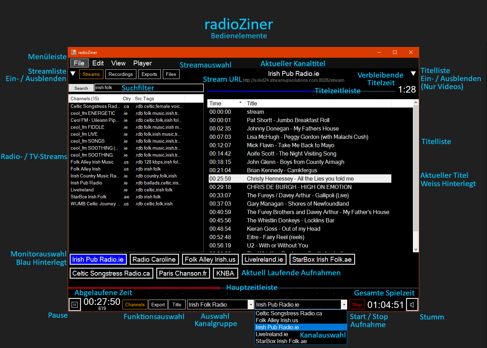

<p align="center">
  <a href="README.md">English</a>
  | 
  Deutsch
</p>

# radioZiner
Streaming-Audio- und Videorekorder




# Installation

* Laden Sie die [neueste Version](https://github.com/eZiner/radioZiner/releases/) herunter (z.B. radioZiner-v#.#.#.zip).
* Erstellen Sie einen Ordner "radioZiner" und entpacken Sie die Dateien in diesen Ordner.
* Starten Sie innerhalb des Ordners radioZiner.exe.
* Sie sollten eine Meldung wie diese erhalten:

```
No streaming directory
Create new streaming directory in "C:\Users\<username>\Videos\radioZiner"?
<Yes>  <No>
```

* Klicken Sie auf "Yes" oder lesen Sie unten, wie Sie ein benutzerdefiniertes Streaming-Verzeichnis erstellen können.

> #### So erstellen und verwenden Sie ein benutzerdefiniertes Streaming-Verzeichnis
>* Legen Sie einen neuen Ordner an (z.B. *myStreamingDirectory*).
>* Erstellen Sie eine Verknüpfung von radioZiner.exe (z. B. *myRadioZiner.exe*).
>* Öffnen Sie die Eigenschaften von *myRadioZiner.exe*.
>* Fügen Sie ein \<Leerzeichen\> + mainDir="*Pfad-Zu-Ihrem-Streaming-Verzeichnis*" an den Zielpfad an.
>* Starten Sie *myRadioZiner.exe*.

* Wählen Sie im Menü Datei/Home (Strg+H), um das Streaming-Verzeichnis im Datei-Explorer zu öffnen.
* Schließen Sie die Anwendung.
* Gehen Sie zum radioZiner-Anwendungsordner und wählen Sie folgende Dateien aus:
    * **backup_de1_2024-03-21.sql** - Die neueste Version kann von radio-browser.info [heruntergeladen](https://backups.radio-browser.info/latest.sql.gz) werden.
    * **index-1.m3u** - Die neueste Version kann von iptv-org [heruntergeladen](https://iptv-org.github.io/iptv/index.m3u) werden.
* Verschieben Sie sie nach \<*Pfad-Zu-Ihrem-Streaming-Verzeichnis*\>\\streams.
* Um Ihre Datenbank zu aktualisieren, ersetzen Sie die Dateien durch die neuesten Versionen.
* Starten Sie radioZiner.exe erneut.
* Nach ein paar Sekunden sollte der Text der Schaltfläche "Suchen" oben links von grau auf schwarz wechseln.
* radioZiner ist jetzt einsatzbereit.

# Erste Schritte nach der Installation

* Neue Kanalgruppe(n) erstellen
    * Wählen Sie Datei/Neu (Strg+N) aus dem Menü.
    * Geben Sie einen Namen für die Kanalgruppe ein (z.B. "Radio") und bestätigen Sie mit \<Enter\> oder brechen Sie mit \<Esc\> ab.
    * Wiederholen Sie den Vorgang, wenn Sie möchten (z. B. "TV", "Irish Folk", ...).
    * Um den Namen einer Kanalgruppe zu ändern, wählen Sie den Namen zweimal aus und drücken Sie \<Enter\>, bearbeiten Sie den Namen und drücken Sie erneut \<Enter\>.
  
* Radio-/Fernsehsender in der Datenbank suchen
    * Klicken Sie in das Textfeld rechts neben der Suchschaltfläche oben links.
    * Geben Sie Suchbegriffe ein (z. B. "pub .ie" für irische Sender mit "pub" im Namen oder in Schlüsselwörtern).
    * Wählen Sie einen Sender aus.
    * Die Wiedergabe beginnt sofort.
 
* Steuerung der Wiedergabe
    * Zum Pausieren/Wiedergeben klicken Sie auf die rechte Maustaste oder verwenden Sie die Pausentaste unten links.
    * Verwenden Sie den Schieberegler auf einer der Zeitleisten oder das Mausrad zum Vor- und Zurückspulen.
    * Die Verwendung des Mausrads ist etwas ungewöhnlich: Mit dem Mauszeiger auf der linken Seite einer Liste ändert das Rad die Schriftgröße, in der Mitte spult es vor/zurück und auf der rechten Seite scrollt es den Inhalt nach oben und unten.
    * Im Pausenmodus schaltet das Mausrad Bild für Bild vor/zurück (Jog/Shuttle).
    * Um die Streamliste ein-/auszublenden, klicken Sie auf den linken Umschalter ▼.
    * Um die Wiedergabeliste ein-/auszublenden während Sie ein Video ansehen, klicken Sie auf den rechten Umschalter ▼.
    * Um alle Steuerelemente ein-/auszublenden, drücken Sie \<F12\>.
    * Um den Vollbildmodus zu aktivieren oder zu deaktivieren, drücken Sie \<F11\> oder doppelklicken Sie in das Video.

* Wiedergabe einer beliebigen Audio-/Videoquelle per Drag/Drop oder Kopieren/Einfügen
    * Ziehen Sie eine gültige Stream- oder Datei-URL auf die Titelliste oder das Video, um ein Audio oder Video abzuspielen.
    * Freie Radiostationen finden Sie hier: [fmstream.org](http://fmstream.org/) | [Icecast Directory](http://dir.xiph.org/) | [RadioBrowser](https://www.radio-browser.info/)
    * Freie TV-Sender/Filme finden Sie hier: [iptv-org](https://iptv-org.github.io/) | [MediathekViewWeb (Deutschland)](https://mediathekviewweb.de/)

* Neue Sender, Dateien oder Ordner zur Kanalgruppe hinzufügen.
    * Während der Wiedergabe eines neuen Senders, einer neuen Datei oder nach dem Ziehen/Einfügen eines Ordners ...
    * Wählen Sie die passende Kanalgruppe für den neuen Sender, dei neue Datei oder den neuen Ordner (z.B. "Irish Folk").
    * Klicken Sie oben auf den Kanalnamen ("Neuer Kanal", wenn er neu ist).
    * Bearbeiten Sie den Namen und bestätigen Sie ihn mit \<Eingabe\> oder brechen Sie ihn mit \<Esc\> ab.
    * Der Channel-Name kann jederzeit auf dieselbe Weise geändert werden. Nach der Änderung bleibt eine Kopie mit dem alten Namen des Kanals bestehen. Löschen Sie die alte Kopie oder verwenden Sie sie als Alias.
    * Lokale Dateien und Ordner, die als Kanäle hinzugefügt wurden, können durch Klicken auf die Schaltfläche "Files" oben ausgewählt werden. Ordner sind durch eckige Klammern \[ \] um den Namen gekennzeichnet. Wenn Sie auf einen Ordner klicken, werden alle abspielbaren Audios/Videos in diesem Ordner und seinen Unterordnern in absteigender Reihenfolge nach Datum aufgelistet. Klicken Sie auf die Schaltfläche "Files" am oberen Rand, um die Liste der Dateien und Ordner erneut aufzurufen/zu aktualisieren.

    
* Kanal verschieben/löschen
    * Wählen Sie einen Kanal und wählen Sie im Menü Edit/Cut (Strg+X).
    * Um den Kanal zu verschieben, wählen Sie eine Kanalgruppe und wählen Sie im Menü Edit/Paste (Strg+V).
    * Der Kanal ist gelöscht, wenn Sie ihn nicht wieder einsetzen.
  
* Stream aufnehmen
    * Klicken Sie unten auf die Schaltfläche "Rec".
    * Die Aufnahme beginnt sofort und der Name des Kanals wird als Schaltfläche zur Aufnahmeliste hinzugefügt.
    * Zum Wiedergeben während der Aufnahme (Monitoring) klicken Sie auf den entsprechenden Kanal in der Aufnahmeliste.
    * Wenn der Kanal neu war, wurde er automatisch der ausgewählten Kanalgruppe hinzugefügt.
    * Um die Aufnahme zu stoppen, klicken Sie unten auf die Schaltfläche "Stop".
    * Einige Videokanäle, wie z. B. ARTE Deutschland, können aufgrund von Streaming-Fehlern, die Probleme bei der mpv-Aufnahme verursachen, nicht korrekt aufgenommen werden. In diesen Fällen können Sie versuchen, die Verwendung von ffmpeg anstelle von mpv zu erzwingen, indem Sie ein @ an den Kanalnamen anhängen.
    * Alle Aufnahmen werden zusammen mit einer Textdatei, die die Wiedergabeliste enthält, in Ihrem Streaming-Verzeichnis gespeichert.
    * Um die Audio-/Videodateien anzuhören/anzusehen, klicken Sie oben auf die Schaltfläche "Recordings". Klicken Sie erneut, um die Liste zu aktualisieren.

# Musiktitel in Audiodateien exportieren

Um einzelne Titel aus den aufgezeichneten Radiosendungen als Audiodatei zu speichern, klicken Sie zunächst oben auf die Schaltfläche "Recordings" und wählen Sie die gewünschte Aufnahme aus. Klicken Sie dann unten auf die Schaltfläche "Export", um die Steuerelemente für die Einstellung der Start-/Endzeit, des Dateinamens und des Exportformats anzuzeigen.

Suchen Sie den Anfang des Titels, den Sie exportieren möchten. Wenn der Radiosender, von dem die Audiodatei aufgenommen wurde, Icecast unterstützt, haben Sie bereits eine Wiedergabeliste. Klicken Sie einfach auf den Titel und Sie sind fast fertig. Oft stimmt die angezeigte Startzeit nicht genau mit dem Beginn des Titels überein. In diesem Fall muss noch eine Feinabstimmung vorgenommen werden.

* Um den Exportnamen und die Startzeit festzulegen, halten Sie die Taste \<Strg\> gedrückt und wählen Sie den Titel in der Wiedergabeliste aus.
* Geben Sie den Exportnamen ein und setzen Sie die beiden Zeitstempel auf der linken Seite des Eingabefeldes.
* Um die Startzeit einzustellen, halten Sie die Taste \<Strg> gedrückt und klicken Sie auf den linken Zeitstempel.
* Um die Endzeit einzustellen, halten Sie die Taste \<Strg\> gedrückt und klicken Sie auf den rechten Zeitstempel.
* Um die Position zu überprüfen, klicken Sie während der Wiedergabe auf den Start-/Endzeitstempel.
* Wählen Sie je nach Stream-Format .mp3 (in den meisten Fällen) oder .aac.
* Klicken Sie abschließend auf die grüne Schaltfläche "Exportieren".

Die exportierte Audiodatei wird in Ihrem Streaming-Verzeichnis gespeichert. Klicken Sie oben auf die Schaltfläche "Exports", um eine Liste Ihrer Exporte zu erhalten. Klicken Sie erneut, um die Liste zu aktualisieren.

# Schnitt & Export in Videodateien

Das Exportieren von Filmen, Szenen oder Sequenzen funktioniert in etwa so wie bei Audiodateien. Geben Sie den Titel ein, legen Sie Start- und Endzeit fest, wählen Sie .mp4 (in den meisten Fällen) oder .ts als Exportformat und klicken Sie schließlich auf die grüne Schaltfläche "Exportieren".


# Bearbeiten der Wiedergabeliste
Klicken Sie unten auf die Schaltfläche "Title", um die Steuerelemente zum Hinzufügen, Löschen und Bearbeiten von Titeln anzuzeigen.

* Zum Bearbeiten/Kopieren/Löschen eines Titels halten Sie die Taste \<Strg\> gedrückt und wählen den Titel aus der Wiedergabeliste oder Zeitleiste aus.
* Zum Löschen des Titels klicken Sie auf die rote Schaltfläche "Delete".
* Falls erforderlich: Um die Startzeit des Titels zu ändern, wählen Sie die gewünschte Stelle, halten Sie die Taste \<Strg\> gedrückt und klicken Sie auf den Zeitstempel. Um die Position zu überprüfen, klicken Sie während der Wiedergabe auf den Zeitstempel.
* Bearbeiten Sie den Titel und bestätigen Sie ihn mit \<Eingabe\> oder brechen Sie ihn mit \<Esc\> ab.
* Um einen neuen Titel hinzuzufügen, klicken Sie auf die grüne Schaltfläche "Add".

Alle Änderungen an der Wiedergabeliste können während der Aufnahme vorgenommen werden. Die Änderungen werden sofort gespeichert und können nicht rückgängig gemacht werden. Seien Sie also vorsichtig!

# Beschriftungen auf der Zeitleiste setzen

Wenn Sie ein Ausrufezeichen ! als erstes Zeichen in den Titel einer Wiedergabeliste einfügen, wird das erste Wort als klickbare Beschriftung unter der Hauptzeitleiste platziert.

Um eine Beschriftung unter der Titelzeitleiste zu platzieren, fügen Sie ein At-Zeichen @ an das entsprechende Wort an, gefolgt von der absoluten Position in Sekunden. Um die aktuelle Position einzufügen, halten Sie die Taste \<Strg\> gedrückt und klicken Sie in das Eingabefeld.

Um die Beschriftung oberhalb der Linie zu platzieren, fügen Sie einen Zirkumflex \^ direkt nach dem Wort ein. Verwenden Sie das Gradzeichen °, um die Beschriftung auf der Linie zu platzieren.

# Mehrspaltige Wiedergabeliste

Benutzen Sie den vertikalen Balken | um Titel in Spalten zu trennen. Dies kann zum Beispiel hilfreich sein, wenn Sie radioZiner als Karaoke-Tool mit verschiedenen Sprachen verwenden.

# Gemeinsame Nutzung (Export/Import) von Kanalgruppen

Kanalgruppen werden als separate M3U/TVG-formatierte (.m3u) Textdateien im Ordner \<*Pfad-Zu-Ihrem-Streaming-Verzeichnis*\>\\channels gespeichert. Um eine Kanalgruppe zu importieren, legen Sie die .m3u-Datei (z.B. [Alle deutschen TV-Sender](https://iptv-org.github.io/iptv/countries/de.m3u)) in den Ordner channels und starten Sie radioZiner neu. Um Kanalgruppen mit Ihren Freunden zu teilen, senden Sie ihnen einfach Ihre .m3u-Dateien.

---

Benötigte Binärdateien:<br>
[ffmpeg.exe](https://www.ffmpeg.org/download.html) FFmpeg [project](https://www.ffmpeg.org/)<br>
[libmpv-2.dll](https://sourceforge.net/projects/mpv-player-windows/files/libmpv/) mpv-player [project](https://github.com/mpv-player/mpv)<br>

